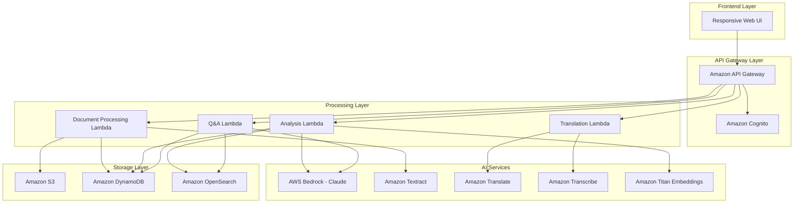

# Design Document: LegalLens Public Legal Access Assistant

## Overview

LegalLens is a serverless, AI-powered legal document analysis platform built on AWS that provides Indian citizens with accessible interpretations of legal documents. The system leverages AWS Bedrock for AI capabilities, implements a privacy-first architecture, and supports multilingual interactions through a responsive web interface.

The platform addresses the critical gap in legal literacy by transforming complex legal language into understandable explanations, identifying risks and obligations, and providing contextual question-answering capabilities through Retrieval-Augmented Generation (RAG).

## Architecture

### High-Level Architecture



### Component Architecture

The system follows a microservices architecture with the following key components:

1. **Frontend Layer**: Responsive web application with voice interface capabilities
2. **API Gateway**: Centralized API management with authentication and rate limiting
3. **Processing Layer**: Serverless Lambda functions for specific business logic
4. **AI Services**: AWS managed AI services for document processing and analysis
5. **Storage Layer**: Multi-tier storage for documents, metadata, and vector embeddings

## Components and Interfaces

### 1. Document Processing Service

**Purpose**: Handles document upload, text extraction, and initial processing

**Key Functions**:
- `uploadDocument(file, userId)`: Uploads and validates document files
- `extractText(documentId)`: Extracts text using Amazon Textract
- `preprocessText(rawText)`: Cleans and structures extracted text
- `identifyDocumentType(text)`: Classifies document type using AI

**Interfaces**:
```typescript
interface DocumentProcessor {
  uploadDocument(file: File, userId: string): Promise<DocumentUploadResponse>
  extractText(documentId: string): Promise<TextExtractionResponse>
  preprocessText(rawText: string): Promise<ProcessedText>
  identifyDocumentType(text: string): Promise<DocumentType>
}

interface DocumentUploadResponse {
  documentId: string
  status: 'processing' | 'completed' | 'failed'
  extractedText?: string
  documentType?: DocumentType
}
```

### 2. Clause Analysis Service

**Purpose**: Analyzes legal documents clause-by-clause and generates simplified explanations

**Key Functions**:
- `segmentClauses(text)`: Identifies and segments individual clauses
- `analyzeClause(clause, documentType)`: Generates simplified explanations
- `detectRisks(clauses)`: Identifies potential risks and obligations
- `generateSummary(analysis)`: Creates document summary

**Interfaces**:
```typescript
interface ClauseAnalyzer {
  segmentClauses(text: string): Promise<Clause[]>
  analyzeClause(clause: Clause, documentType: DocumentType): Promise<ClauseAnalysis>
  detectRisks(clauses: Clause[]): Promise<RiskAlert[]>
  generateSummary(analysis: DocumentAnalysis): Promise<DocumentSummary>
}

interface Clause {
  id: string
  originalText: string
  position: number
  type: ClauseType
}

interface ClauseAnalysis {
  clauseId: string
  simplifiedExplanation: string
  keyPoints: string[]
  riskLevel: 'low' | 'medium' | 'high'
  obligations: string[]
}
```

### 3. RAG Engine Service

**Purpose**: Provides contextual question-answering using document-specific knowledge

**Key Functions**:
- `createEmbeddings(text)`: Generates vector embeddings for text chunks
- `storeEmbeddings(documentId, embeddings)`: Stores embeddings in vector database
- `retrieveContext(query, documentId)`: Retrieves relevant context for queries
- `generateAnswer(query, context)`: Generates answers using retrieved context

**Interfaces**:
```typescript
interface RAGEngine {
  createEmbeddings(text: string): Promise<number[]>
  storeEmbeddings(documentId: string, embeddings: DocumentEmbedding[]): Promise<void>
  retrieveContext(query: string, documentId: string): Promise<RetrievedContext[]>
  generateAnswer(query: string, context: RetrievedContext[]): Promise<AnswerResponse>
}

interface DocumentEmbedding {
  chunkId: string
  text: string
  embedding: number[]
  metadata: ChunkMetadata
}

interface AnswerResponse {
  answer: string
  confidence: number
  sources: SourceReference[]
  limitations?: string
}
```

### 4. Language Processing Service

**Purpose**: Handles multilingual translation and voice processing

**Key Functions**:
- `translateText(text, targetLanguage)`: Translates text to regional languages
- `detectLanguage(text)`: Automatically detects input language

**Interfaces**:
```typescript
interface LanguageProcessor {
  translateText(text: string, targetLanguage: string): Promise<TranslationResponse>
  speechToText(audioData: ArrayBuffer, language: string): Promise<TranscriptionResponse>
  textToSpeech(text: string, language: string): Promise<AudioResponse>
  detectLanguage(text: string): Promise<LanguageDetectionResponse>
}

interface TranslationResponse {
  translatedText: string
  sourceLanguage: string
  targetLanguage: string
  confidence: number
}
```

### 5. User Management Service

**Purpose**: Handles user authentication, authorization, and session management

**Key Functions**:
- `registerUser(userData)`: Creates new user accounts
- `authenticateUser(credentials)`: Validates user credentials
- `manageSession(userId)`: Handles session lifecycle
- `authorizeAccess(userId, resourceId)`: Controls resource access

**Interfaces**:
```typescript
interface UserManager {
  registerUser(userData: UserRegistration): Promise<UserResponse>
  authenticateUser(credentials: LoginCredentials): Promise<AuthResponse>
  manageSession(userId: string): Promise<SessionInfo>
  authorizeAccess(userId: string, resourceId: string): Promise<boolean>
}

interface UserResponse {
  userId: string
  email: string
  preferredLanguage: string
  createdAt: Date
}
```

## Data Models

### Core Data Structures

```typescript
// Document Model
interface LegalDocument {
  documentId: string
  userId: string
  fileName: string
  fileType: 'pdf' | 'image'
  documentType: DocumentType
  uploadedAt: Date
  status: DocumentStatus
  s3Key: string
  extractedText: string
  metadata: DocumentMetadata
}

// Document Analysis Model
interface DocumentAnalysis {
  analysisId: string
  documentId: string
  clauses: ClauseAnalysis[]
  riskAlerts: RiskAlert[]
  summary: DocumentSummary
  createdAt: Date
  language: string
}

// Risk Alert Model
interface RiskAlert {
  alertId: string
  clauseId: string
  riskType: RiskType
  severity: 'low' | 'medium' | 'high'
  description: string
  recommendation: string
  affectedClauses: string[]
}

// User Session Model
interface UserSession {
  sessionId: string
  userId: string
  documents: string[]
  preferredLanguage: string
  voiceEnabled: boolean
  createdAt: Date
  lastActivity: Date
}

// Q&A History Model
interface QuestionAnswer {
  qaId: string
  documentId: string
  userId: string
  question: string
  answer: string
  sources: SourceReference[]
  timestamp: Date
  language: string
}
```

### Database Schema

**DynamoDB Tables**:

1. **Users Table**
   - Partition Key: userId
   - Attributes: email, preferredLanguage, createdAt, lastLogin

2. **Documents Table**
   - Partition Key: userId
   - Sort Key: documentId
   - Attributes: fileName, documentType, status, s3Key, uploadedAt

3. **Analyses Table**
   - Partition Key: documentId
   - Sort Key: analysisId
   - Attributes: clauses, riskAlerts, summary, createdAt

4. **QA_History Table**
   - Partition Key: userId
   - Sort Key: timestamp
   - Attributes: documentId, question, answer, sources

**Amazon OpenSearch Indices**:

1. **Document_Embeddings Index**
   - Fields: documentId, chunkId, embedding (vector), text, metadata

2. **Legal_Knowledge Index**
   - Fields: documentType, clauseType, embedding (vector), explanation, examples

## Correctness Properties

*A property is a characteristic or behavior that should hold true across all valid executions of a system—essentially, a formal statement about what the system should do. Properties serve as the bridge between human-readable specifications and machine-verifiable correctness guarantees.*

Before defining the correctness properties, I need to analyze the acceptance criteria to determine which ones are testable as properties.

Based on the prework analysis, I'll now convert the testable acceptance criteria into correctness properties:

### Property 1: Document Processing Completeness
*For any* valid document (PDF or image), the system should successfully extract text content and confirm processing completion
**Validates: Requirements 1.1, 1.2, 1.3**

### Property 2: Input Validation and Error Handling
*For any* invalid input (unsupported format or oversized file), the system should reject the input and provide appropriate error messaging
**Validates: Requirements 1.4, 1.5**

### Property 3: Clause Analysis Completeness
*For any* processed legal document, the system should identify all clauses and generate explanations for each identified clause
**Validates: Requirements 2.1, 2.2**

### Property 4: UI Interaction Consistency
*For any* clause selection by a user, the system should highlight the original text and display the corresponding explanation
**Validates: Requirements 2.4**

### Property 5: Risk and Obligation Detection
*For any* legal document analysis, the system should identify risks and obligations, and generate categorized alerts for detected risks
**Validates: Requirements 3.1, 3.2, 3.3, 3.4**

### Property 6: Comprehensive Translation Support
*For any* user-selected regional language, the system should translate all interface elements, explanations, and alerts to that language
**Validates: Requirements 4.1, 4.2, 4.3**

### Property 7: Question Answering with Citations
*For any* user question about a document, the system should provide answers with document references and citations, or clearly indicate when questions cannot be answered
**Validates: Requirements 5.1, 5.2, 5.3, 5.4**

### Property 8: Contextual Ambiguity Handling
*For any* question with multiple possible interpretations, the system should present the most likely interpretation with appropriate caveats
**Validates: Requirements 5.5**

### Property 9: Document Type Classification
*For any* analyzed document, the system should identify the document type or request user clarification when type cannot be determined
**Validates: Requirements 6.1, 6.5**

### Property 10: Document-Type-Specific Risk Patterns
*For any* document of a specific type, the risk detection should apply patterns appropriate to that document type
**Validates: Requirements 6.3**

### Property 11: Data Security and Encryption
*For any* user document upload, the system should encrypt the document during transmission and storage
**Validates: Requirements 7.1**

### Property 12: User Data Isolation
*For any* user accessing documents, the system should only display documents associated with their account and enforce proper access control
**Validates: Requirements 7.2, 7.5, 9.4**

### Property 13: Complete Data Deletion
*For any* user deletion request, the system should permanently remove all associated data according to retention policies
**Validates: Requirements 7.3, 7.4**

### Property 16: User Authentication and Session Management
*For any* user registration or login, the system should create secure accounts, authenticate credentials, establish sessions, and require re-authentication for expired sessions
**Validates: Requirements 9.1, 9.2, 9.3, 9.5**

### Property 17: Responsive Interface Adaptation
*For any* device type or screen orientation, the system should adapt the interface layout appropriately for the specific device and orientation
**Validates: Requirements 10.1, 10.2, 10.3, 10.4**

## Error Handling

### Error Categories and Responses

1. **Document Processing Errors**
   - Invalid file formats: Return HTTP 400 with specific format requirements
   - File size exceeded: Return HTTP 413 with size limit information
   - OCR failures: Return HTTP 422 with retry suggestions
   - Text extraction failures: Log error and provide fallback options

2. **AI Service Errors**
   - Bedrock API failures: Implement exponential backoff and circuit breaker
   - Translation service errors: Fall back to original language with notification
   - Embedding generation failures: Retry with different chunk sizes
   - Voice processing errors: Gracefully fall back to text mode

3. **Authentication and Authorization Errors**
   - Invalid credentials: Return HTTP 401 with clear messaging
   - Expired sessions: Return HTTP 401 and redirect to login
   - Insufficient permissions: Return HTTP 403 with explanation
   - Rate limiting: Return HTTP 429 with retry-after header

4. **Data Storage Errors**
   - S3 upload failures: Retry with exponential backoff
   - DynamoDB write failures: Implement transaction retries
   - OpenSearch indexing failures: Queue for retry processing
   - Data corruption: Implement data integrity checks

### Error Recovery Strategies

- **Graceful Degradation**: Core functionality remains available even when advanced features fail
- **Retry Logic**: Implement intelligent retry mechanisms with exponential backoff
- **Circuit Breakers**: Prevent cascade failures by temporarily disabling failing services
- **Fallback Mechanisms**: Provide alternative paths when primary services are unavailable
- **User Communication**: Clear, actionable error messages in user's preferred language

## Testing Strategy

### Dual Testing Approach

The system requires both unit testing and property-based testing for comprehensive coverage:

**Unit Tests**:
- Focus on specific examples and edge cases
- Test integration points between AWS services
- Validate error conditions and boundary cases
- Test specific document types and formats
- Verify authentication and authorization flows

**Property-Based Tests**:
- Verify universal properties across all inputs
- Test with randomly generated documents and user inputs
- Validate system behavior with various file types and sizes
- Test multilingual functionality across supported languages
- Verify security properties with different user scenarios

### Property-Based Testing Configuration

- **Testing Framework**: Use Hypothesis (Python) or fast-check (TypeScript/JavaScript)
- **Minimum Iterations**: 100 iterations per property test
- **Test Tagging**: Each property test must reference its design document property
- **Tag Format**: **Feature: legal-lens-assistant, Property {number}: {property_text}**

### Testing Coverage Requirements

1. **Document Processing Tests**
   - Unit tests for specific PDF and image formats
   - Property tests for document processing completeness
   - Edge case tests for corrupted or unusual files

2. **AI Service Integration Tests**
   - Unit tests for specific AWS Bedrock responses
   - Property tests for clause analysis and risk detection
   - Mock tests for service failures and recovery

3. **Security and Privacy Tests**
   - Unit tests for specific authentication scenarios
   - Property tests for data isolation and access control
   - Penetration tests for security vulnerabilities

4. **Multilingual Tests**
   - Unit tests for specific language translations
   - Property tests for comprehensive translation support

5. **Performance and Scalability Tests**
   - Load tests for concurrent document processing
   - Stress tests for large document handling

### Integration Testing Strategy

- **End-to-End Tests**: Complete user workflows from document upload to analysis
- **Service Integration Tests**: Verify proper communication between Lambda functions
- **AWS Service Tests**: Validate integration with Bedrock, Textract, and other AWS services
- **Cross-Browser Tests**: Ensure responsive interface works across different browsers
- **Mobile Device Tests**: Validate functionality on various mobile devices and screen sizes

The testing strategy ensures that both specific examples (unit tests) and universal properties (property tests) are thoroughly validated, providing comprehensive coverage for the LegalLens system's correctness and reliability.